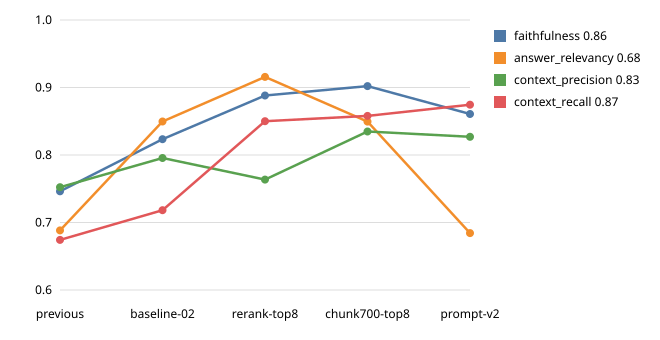

# TMDB MCP & Agentic Learning Lab

A hands-on lab for learning MCP protocol fundamentals, wrapping REST APIs as MCP
tools, retrieval-augmented generation, and (eventually) agent architecture —
built as one real running system on top of [TMDB](https://developer.themoviedb.org)
(The Movie Database) rather than toy examples. The project itself isn't the
point; the point is becoming able to build and lead agentic/MCP projects from
scratch.

Three services, one shared `pyproject.toml`:

| Service | Role | Port |
|---|---|---|
| `data_service` | FastAPI + Postgres — TMDB catalog (titles, people, credits, reviews), watchlist/ratings/lists, bulk seed + daily incremental sync | `8000` |
| `rag_service` | FastAPI — chunking, embeddings, ChromaDB vector store, Cohere reranking, `/search` over real review text | `8020` |
| `mcp_server` | MCP server (official Python MCP SDK) exposing both of the above as tools/resources/prompts | stdio by default, or `8010` over Streamable HTTP |

## Milestone status

| # | Milestone | Status |
|---|---|---|
| M0 | Foundation — DB models, bulk seed, daily sync, FastAPI CRUD | ✅ Done |
| M1 | MCP Server v1 — stdio transport, 11 catalog/watchlist/rating/list/sync tools | ✅ Done |
| M2 | Streamable HTTP transport, Resources, Prompts, Sampling, schema versioning | ✅ Done |
| M3 | API-wrapping robustness — pagination, backoff, idempotency, error normalization, response contract validation, inbound throttling | ✅ Done |
| M4 | RAG subsystem — ChromaDB + Voyage embeddings + Cohere reranker, `search_reviews` MCP tool, RAGAS eval harness | ✅ Done |
| M5 | LangGraph agent layer | ⏳ Next |
| M6–M11 | UI, multi-tenant, security, infra/devops, testing/evals, alternatives lab | Planned |

## Setup

**Prerequisites:** Python 3.11+, [uv](https://docs.astral.sh/uv/), Docker.

1. Install dependencies:
   ```
   uv sync
   ```
2. Copy `.env.example` to `.env` and fill in real values — TMDB v4 bearer
   token, Postgres credentials, Voyage AI + Cohere keys (for `rag_service`),
   and OpenAI key (for the RAGAS eval harness only — see `evals/rag/`).
3. Start Postgres and Chroma:
   ```
   docker run -d --name tmdb-postgres -p 5432:5432 \
     -e POSTGRES_USER=tmdb_app -e POSTGRES_PASSWORD=tmdb_local_dev_pw -e POSTGRES_DB=tmdb_local \
     postgres:16
   docker run -d --name tmdb-chroma -p 8001:8000 chromadb/chroma
   ```
4. Initialize the schema and seed data:
   ```
   uv run python -m data_service.init_db
   uv run python -m data_service.seed.bulk_seed --movies 1500 --tv 500
   uv run python -m data_service.seed.fetch_reviews
   ```
5. Ingest reviews into the vector store:
   ```
   uv run python -m rag_service.ingest
   ```

## Running the services

```
uv run uvicorn data_service.main:app --port 8000
uv run uvicorn rag_service.main:app --port 8020
cd mcp_server && uv run mcp dev server.py     # MCP Inspector, stdio
```

Set `MCP_TRANSPORT=streamable-http` in `.env` to run `mcp_server` as an HTTP
server on port `8010` instead.

## MCP surface

**13 tools** — `search_titles`, `get_title_details`, `get_recommendations`,
`add_to_watchlist`, `remove_from_watchlist`, `list_watchlist`, `rate_title`,
`create_list`, `add_to_list`, `sync_status`, `trigger_sync`,
`generate_watchlist_blurb` (sampling), and `search_reviews` (M4 — semantic
search over real review text, distinct from `search_titles`'s structured
lookup).

**3 resources** (`tmdb://title/{id}`, `tmdb://person/{id}`, watchlist) and
**2 prompts** (`summarize_watchlist`, `recommend_for_mood`).

## Evals

`evals/rag/` is M4's acceptance bar and the tuning loop for the RAG pipeline:
55 hand-written `(question, ground_truth)` cases in `eval_set.json`, each
grounded in real fetched reviews. Scored with RAGAS (faithfulness, answer
relevancy, context precision, context recall) on the modern
`ragas.metrics.collections` API, with `gpt-4o-mini` as both answer generator
(temperature 0, so runs are comparable) and judge.

| Script | Role |
|---|---|
| `sync_dataset.py` | Mirrors `eval_set.json` into a LangSmith Dataset (idempotent: updates existing cases, creates new ones). Re-run whenever the eval set changes. |
| `run_ragas_eval.py` | `langsmith.evaluate()` harness: retrieve, generate, score per case with bounded concurrency. Each run is a named LangSmith experiment; scores also written to `results.json`. |
| `diagnose_retrieval.py` | For below-average cases, finds which stage lost each gold review: `not_ingested`, `embedding_miss` (Chroma), `reranker_demoted` (Cohere) or `retrieved_ok`. Tells you which knob to turn. |
| `compare_runs.py` | Diffs two `results.json` snapshots: aggregate deltas plus per-case regressions and improvements. |
| `plot_experiments.py` | Charts every `results_<name>.json` snapshot: writes `experiments.svg` (README chart) and `experiments.html` (interactive: trends, per-case before/after scatter with question on hover, per-category bars; open it in a browser). |

```
uv run python -m evals.rag.sync_dataset
uv run python -m evals.rag.run_ragas_eval
uv run python -m evals.rag.diagnose_retrieval
uv run python -m evals.rag.compare_runs evals/rag/results_baseline-02.json evals/rag/results_rerank-top8.json
uv run python -m evals.rag.plot_experiments
```

Traces land in LangSmith with a run type per stage (`chain`, `retriever`,
`tool`, `prompt`, `llm`, `embedding`), so each module can be filtered on its
own. Experiments live under Datasets & Experiments, then `tmdb-rag-eval-set`,
then the Experiments tab. They are not in the plain Tracing Projects list.

### Experiments

Tuning loop: change one knob in `.env` (chunking or embedding changes also
need a fresh `CHROMA_COLLECTION` name and `python -m rag_service.ingest`, since
ingest skips reviews already stored and would leave the old chunks in place),
set `_EXPERIMENT_PREFIX` in `run_ragas_eval.py` to name the run, re-run, snapshot `results.json` as
`results_<name>.json` (`results.json` itself is gitignored), then diff with
`compare_runs.py` and re-run `plot_experiments.py`. Change one thing per
experiment so each delta has one cause.

| Experiment | What changed | Faithfulness | Answer relevancy | Context precision | Context recall |
|---|---|---|---|---|---|
| `previous` (old harness) | Legacy RAGAS `single_turn_score`, generation at default temperature 1.0. **Not comparable** to the rows below | 0.746 | 0.688 | 0.752 | 0.674 |
| `baseline-02` | New harness (modern RAGAS API, temp 0, `langsmith.evaluate`), `RERANK_TOP_N=5`, `FETCH_K=20`, chunks 400/100, `voyage-4-lite`, `rerank-v3.5` | 0.823 | 0.850 | 0.796 | 0.718 |
| `rerank-top8` | `RERANK_TOP_N` 5 to 8, nothing else | 0.888 | 0.916 | 0.764 | **0.850** |
| `chunk700-top8` | `CHUNK_SIZE` 400 to 700, `CHUNK_OVERLAP` 100 to 150 (new Chroma collection, full re-ingest), `RERANK_TOP_N` stays 8 | 0.902 | 0.849 | **0.835** | 0.858 |
| `prompt-v2` | Generation system prompt only (verdict-first answers); retrieval identical to `chunk700-top8`. **Worse; v1 prompt kept** | 0.861 | 0.684 | 0.827 | 0.875 |
| Change, baseline-02 to rerank-top8 | | +0.065 | +0.066 | -0.032 | **+0.132** |
| Change, rerank-top8 to chunk700-top8 | | +0.014 | -0.066 (see below) | **+0.071** | +0.008 |



**Why `RERANK_TOP_N` was the first knob.** `diagnose_retrieval.py` on the 37
below-average `baseline-02` cases (76 gold reviews) gave 47 `retrieved_ok`, 27
`reranker_demoted`, 2 `embedding_miss` and 0 `not_ingested`. Cohere found most
of the missing gold reviews but ranked them below position 5, and 23 cases lost
at least one this way. Ingestion and embedding were not the bottleneck, so the
reranker cutoff was.

**What `rerank-top8` did.** Context recall improved on 17 cases and dropped on
1. Precision dropped on 12 cases and rose on 7, the expected cost of handing
the model about 8 chunks instead of 5. Faithfulness and answer relevancy rose
because the answer now has the evidence it needs. Context recall by question
category, `baseline-02` to `rerank-top8`:

| Category (cases) | Recall before | Recall after |
|---|---|---|
| agreement (18) | 0.66 | 0.80 |
| disagreement (17) | 0.70 | 0.82 |
| comparison (12) | 0.76 | 0.89 |
| element_critique (4) | 0.83 | 0.92 |
| ending_analysis (2) | 0.67 | 1.00 |
| catalog_wide (2) | 1.00 | 1.00 |

Verdict: for this corpus, 8 beats 5. Recall gains 0.13 for 0.03 of precision.

**What `chunk700-top8` did.** Chunks went from about 317 to 510 characters on
average (35,747 chunks down to 20,999 for the same 7,318 reviews), so the 8
returned chunks now carry about 55% more text per query (2.5k to 3.9k
characters). Context precision improved on 24 cases and dropped on 8, lifting
the mean by 0.071, and recall held (+0.008: up on 11 cases, down on 6, with
`case_005` falling from 1.00 to 0.00). Faithfulness rose slightly.
Caveat: the extra precision and the longer prompt come together, so weigh it
against the higher generation cost and latency per query.

**Why `answer_relevancy` "fell" 0.066 and why it's not a real regression.**
RAGAS scores an answer 0.00 outright when its judge decides the answer is
"noncommittal". Hedged answers ("some reviewers liked it, others didn't") trip
this, and hedging is the correct answer to many "do reviewers agree" questions.
The zeros are repeatable: re-scoring the same answer gives 0.00 every time.
The 700-character run produced 6 such zeros against 2 in the previous run
(`case_018` and `case_029` in both). Excluding exact zeros, mean relevancy is
0.950 before and 0.953 after, so read this metric as "how many answers hedged",
not as noise, and compare the non-zero mean alongside the headline.

**What `prompt-v2` did (a failed hypothesis).** The idea was that a
verdict-first prompt ("say plainly whether reviewers agree, disagree, or are
mixed") would stop RAGAS marking answers noncommittal. It did the opposite:
exact-0.00 relevancy scores went from 6 cases to 15, faithfulness fell 0.041
(21 cases down, 11 up), and answers grew 47% longer (399 to 588 characters).
"Reviewers are mixed" is precisely the kind of answer RAGAS's noncommittal
check penalises, and asking the model to say what isn't covered gave it more
to hedge about (`ending_analysis` relevancy went 0.99 to 0.00). Excluding
zeros, relevancy barely moved (0.953 to 0.941), so the answers were not worse
in content, only more often flagged. Precision and recall, which don't read the
answer, moved by -0.008 and +0.017 with identical retrieval, which is a useful
**noise floor of about +/-0.02** on this eval: `chunk700-top8`'s +0.071
precision gain is well outside it, its +0.008 recall gain is not.
Takeaway: for "do reviewers agree" questions, `answer_relevancy` structurally
punishes honest mixed answers, so track its non-zero mean and its zero count
separately and don't tune the prompt to chase it. M5's agent prompt should be
judged on faithfulness and on real answers, not this number.

Next experiments: `RERANK_TOP_N` 5-6 on the 700-character chunks (bigger
chunks may need fewer of them to match the old context size), a
relevance-score cutoff in place of a fixed count, and `FETCH_K` (2 cases were
true embedding misses).

**Caveats.** One run per configuration, 55 cases, and an LLM judge, so small
per-case moves are noise; the `ending_analysis` and `catalog_wide` categories
have only 2 cases each. `answer_relevancy` has flat 0.00
scores for answers RAGAS judges noncommittal (see above), which can swing its
mean by several points on its own. Six cases (`case_003`, `004`,
`008`, `011`, `021`, `028`) have broadened ground truth flagged with
`_ground_truth_note`; their `source_review_ids` still need backfilling.

### Harness notes

- `results.json` holds `{"aggregate", "rows"}`; every row is tagged with its
  question `category` and `custom_id`, ready for a future UI.
- Each evaluator call builds its own async OpenAI client and runs under a hard
  240-second timeout. Reusing one client across the fresh event loops that
  `asyncio.run` creates is the suspected cause of runs hanging at 54/55.
  Unconfirmed on a full clean run.
- Cohere's trial key allows 10 calls/min, so `rerank()` retries 429s with
  backoff and concurrency is capped at 2.
- `rag_service.ingest` embeds 25 reviews per Voyage call (falling back to one
  review at a time if a batch fails). The per-review version needed about 2.5
  hours for the full corpus; batched it takes about 20 minutes.
- OpenAI's Batch API was tried for answer generation and removed: it can't
  nest under a LangSmith trace and made tuning runs slow to re-run.

## Testing

```
uv run pytest
```

Unit/integration tests per service (`tests/data_service/`, `tests/mcp_server/`,
`tests/rag_service/`) — isolated Postgres transactions (rolled back per test),
mocked TMDB/Cohere/Chroma calls, no real network access required.
